# DROP

Send a file to any device by sharing a passphrase. It streams straight from one machine to the other, encrypted end to end. The relay that connects the two ends never sees your bytes.



**Try it:** your self-hosted relay

## How it works

The sender picks a file and gets a passphrase like `RIVER FALCON MARBLE 42`. The receiver enters it on the website, in the terminal (`drop download RIVER FALCON MARBLE 42`), or by scanning the QR. The file then transfers directly between the two devices, encrypted the whole way.

If the receiver is offline, the sender can use **mailbox** mode: the relay holds the encrypted file for 10 minutes until it's picked up. Same passphrase either way. The receiver never has to know which mode was used.

## Getting past NAT

Two devices on home or office networks usually can't reach each other directly. Each one sits behind a router doing NAT, which drops connections it didn't expect, so neither side can just dial the other.

DROP gets around this the way peer-to-peer normally does. Both devices open an **outbound** connection to the relay (outbound traffic passes through NAT freely), and the relay introduces them. Over that channel they run a short **handshake**, trading their public addresses and candidate routes until they find a path that punches through both NATs. Once it's open the file flows **directly** between them and the relay drops out.

If the NATs are too strict to punch through, the transfer falls back to the relay, which forwards the encrypted bytes blind. It still can't read them.

## Self-host

```bash
git clone https://github.com/whaeuser/Airpipe.git && cd Airpipe
docker compose build && docker compose up -d
```

One Go binary, ~15 MB image, bundling the web UI and install script.

Point the CLI at your relay with `export DROP_RELAY=https://your-server.example` (or `--relay` per call). Tunables, all optional:

| Var | Default | Notes |
|---|---|---|
| `PORT` | `8080` | |
| `DROP_ALLOWED_ORIGINS` | same-origin | Extra origins if pages serve from another domain. `*` = any. |
| `DROP_RATE_LIMIT_PER_MIN` | `60` | |
| `DROP_MAX_UPLOAD_MB` | `500` | Mailbox size cap. |
| `DROP_FILE_EXPIRY` | `10m` | Mailbox expiry (Go duration). |

The relay reports config and stats at `/health` (JSON) and `/metrics` (Prometheus). The web UI reads the real limits from `/health`.

## CLI

```bash
curl -sSL https://your-relay.example/install.sh | sh   # or: go install github.com/whaeuser/Airpipe/cmd/drop@latest
```

Linux, macOS, Windows (amd64 + arm64). Self-update with `drop update`.

```bash
drop send report.pdf              # prompts: direct (P2P) or mailbox
drop send file1.txt photos/       # multiple files / folders auto-zip
drop download RIVER FALCON MARBLE 42
drop receive ./downloads          # wait for someone to send to you; prints a QR
```

## Browser to browser

Open [`/live`](https://your-relay.example/live) for a passphrase + QR, no install on either side. The receiver enters it at the homepage and the file transfers between the two browsers.

## Encryption

NaCl secretbox (XSalsa20 + Poly1305, 256-bit), layered on DTLS for the direct path. The passphrase derives both the relay token and the encryption key via domain-separated SHA-256, identical on CLI and browser. The key never leaves the device that made it; the relay only ever sees a room token and ciphertext.

## Stack

Go relay (gorilla/websocket, pion/webrtc), embedded HTML/CSS/JS frontend (tweetnacl.js in the browser), Docker, optional Cloudflare Tunnel. Single static binary.

## License

MIT
